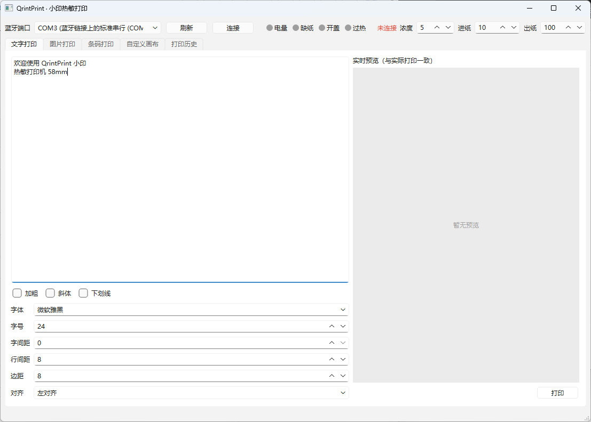
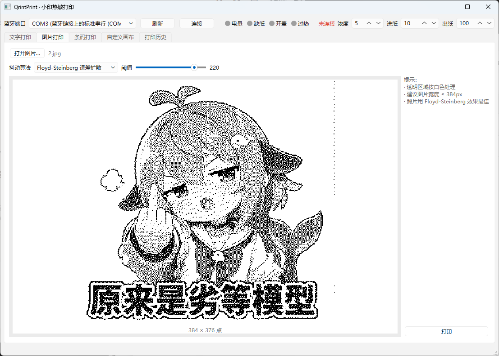
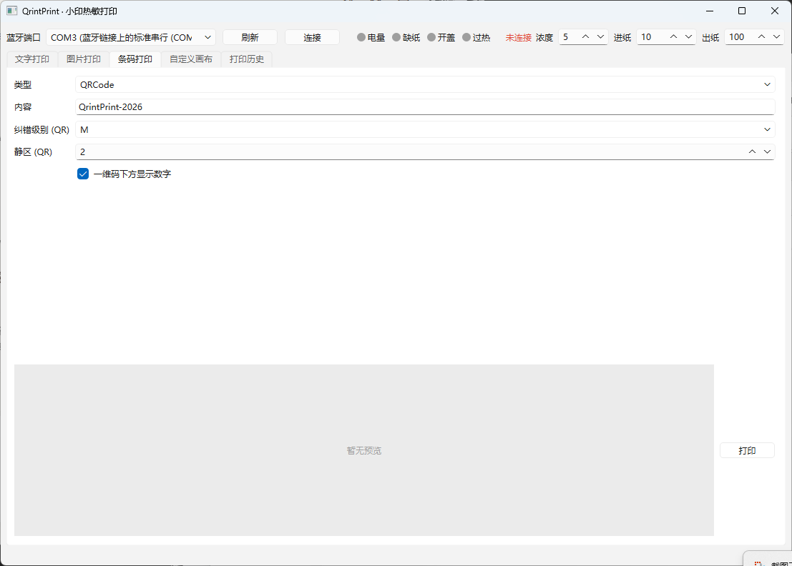
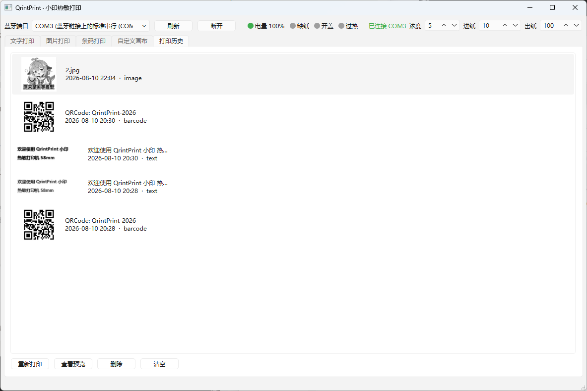

# QringPrint-Windows
本项目使用了 Thisko/QrintPrint的代码
 作为windows客户端的底层支持。感谢 Thisko 开源的打印解决方案，为本项目开发的提供了极大的便利。

面向 58mm 蓝牙热敏打印机的 Windows 桌面程序。
支持错题、便签、标签打印：文字排版、图片抖动、条码/二维码、自定义画布、
设备体检与打印历史。

## 快速开始

1. 系统蓝牙中配对打印机（配对后 Windows 会生成一个“传出”的虚拟 COM 口，
   一般是 COM4~COM8 之一）。
2. 双击 `run.bat`，或运行 `python qrintprint.py`。
3. 顶部选择蓝牙端口（默认 COM3），点「连接」。
4. 在任一页签排版内容，点「打印」。

依赖已随项目放在 `vendor/` 目录，程序启动时自动加载，**无需安装任何东西**。

## 功能

### 文字打印
- 字体 / 字号 / 加粗 / 斜体 / 下划线
- 字间距、行间距、边距、左中右对齐
- 多行自动换行，实时预览与实际打印输出一致

### 图片打印
- 阈值二值化
- Floyd-Steinberg 误差扩散（照片推荐）
- Ordered 4×4 有序抖动
- Bayer 8×8 抖动
- 透明区域按白色处理，自动缩放至 384 点宽

### 条码打印
- 二维码 QR（L/M/Q/H 纠错、静区可调）
- Code128 / Code39 / EAN13 / EAN8 / UPCA / ITF / Codabar
- 内容实时校验（位数、字符集、容量），输入防抖生成预览

### 自定义画布
- 插入文字 / 图片 / 条码，拖拽移动、8 向手柄缩放
- 双击条目编辑内容
- 模板保存 / 加载 / 重命名 / 删除（含缩略图）

### 可靠性
- 电量 / 缺纸 / 开盖 / 过热实时监测（顶部状态灯）
- 打印前自动体检，故障时拦截并给出原因
- 打印期间暂停状态轮询，避免查询字节混入打印数据流
- 冷启动自动重连上次设备

### 本地数据
- 打印历史持久化（含 384 点宽预览与缩略图），一键重新打印
- 数据目录：`data/`（config.json、templates/、history/）

## 打印设置

顶部栏可设置：
- 浓度：打印加热强度（0~7，一般用 1）
- 进纸：打印前走纸点数
- 出纸：打印后走纸点数

## 目录结构

```
QrintPrint-Windows/
├── qrintprint.py        # 入口
├── app/
│   ├── driver.py        # 打印机协议驱动（SPP 串口）
│   ├── device.py        # 设备管理：连接/轮询/体检/打印线程
│   ├── render.py        # 文字/图片/条码渲染与抖动
│   ├── canvas.py        # 自定义画布
│   ├── storage.py       # 模板与历史持久化
│   ├── ui.py            # 主窗口
│   └── config.py        # 配置
├── vendor/              # 自包含第三方依赖
├── data/                # 运行期数据（自动创建）
├── qring-spp.py         # 原 CLI 驱动（保留）
├── requirements.txt
└── run.bat
```

## 打包为 exe（可选）

项目已附带打包配置，安装 PyInstaller 后执行：

```
pip install pyinstaller
pyinstaller qrintprint.spec
```

产物在 `dist/QrintPrint/`，双击 `QrintPrint.exe` 即可运行，
可整体拷贝到任意 Windows 机器。打包后数据（配置/模板/历史）自动
存放在 exe 同级的 `data/` 目录，与源码运行方式一致。

验证打包产物可正常启动：

```
QrintPrint.exe --selftest
```

自检会构建完整主窗口后自动退出；若同级 `data/selftest.ok` 文件生成即正常。

## 说明

- 打印协议见 `qring-spp.py`。
  与官方 SDK 字节级兼容：384 点宽、GS v 0 光栅、0xAA 打印完成 ACK。
- 电量显示为启发式换算：固件返回 0~100 时直接使用，否则按电压估算。
- 若 COM 口无法打开，请确认打印机已开机、蓝牙已配对，并在系统
  “设备管理器 → 端口”中确认虚拟串口号。

  ## 界面
|  |  |  |  | 